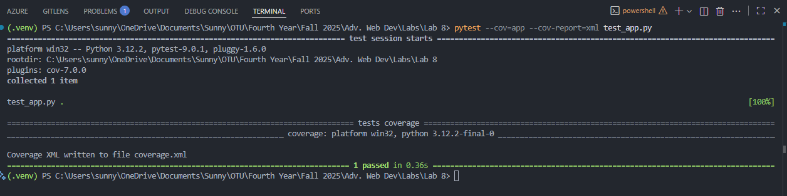
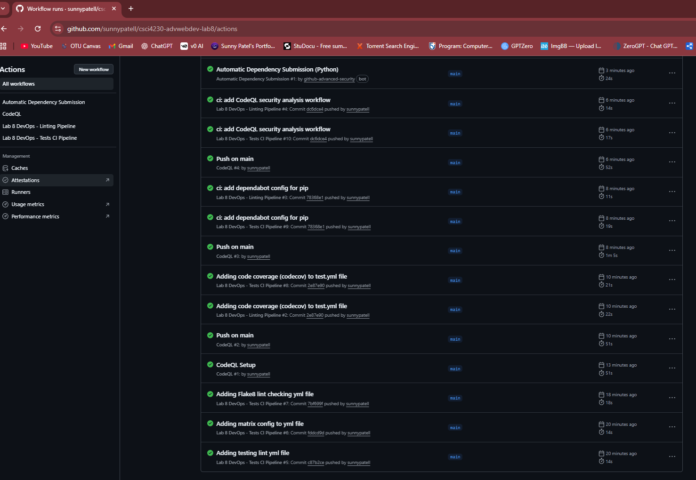
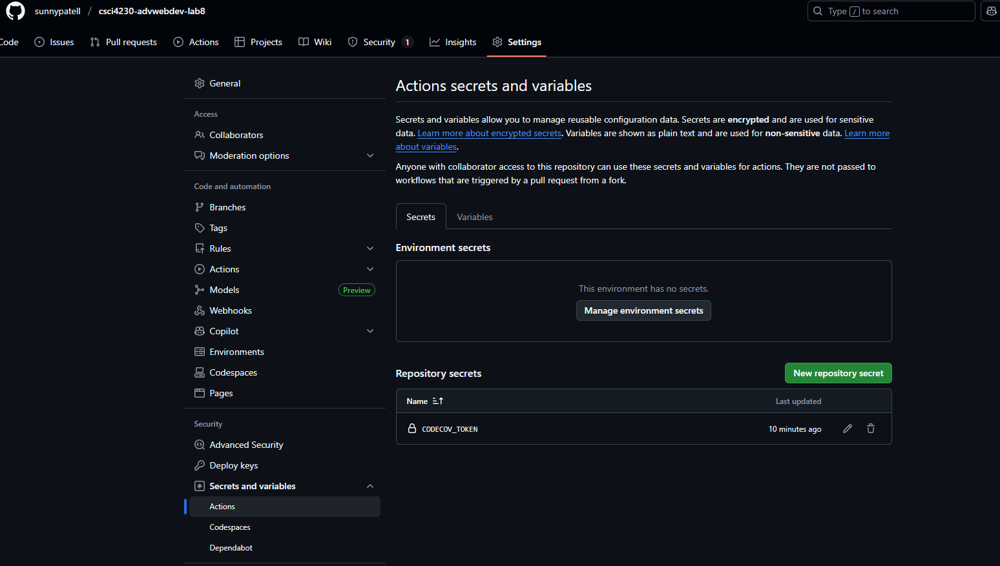
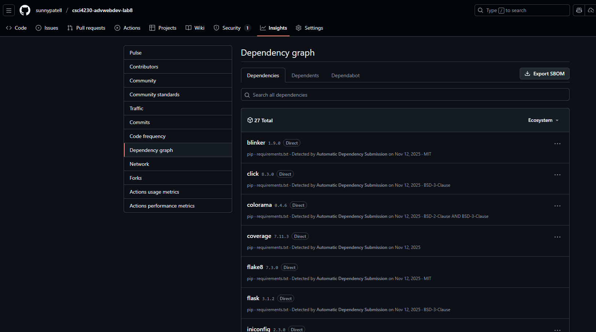

# Lab 8 — DevOps in Action: CI/CD for a Flask App (CSCI 4230)

[](https://github.com/sunnypatell/csci4230-advwebdev-lab8/actions/workflows/test.yml)
[](https://github.com/sunnypatell/csci4230-advwebdev-lab8/actions/workflows/lint.yml)

> Author: Sunny Patel (100867748)  \
> Course: CSCI 4230 — Advanced Web Development (Faculty of Science)  \
> Lab: 8 — DevOps in Action — CI/CD for a Flask App using Advanced GitHub Actions  \
> Due: Sunday, November 16, 2025 @ 11:59 PM

This repository implements a complete CI/CD learning lab around a minimal Flask service, demonstrating:

- Automated tests with coverage (pytest + pytest-cov)
- GitHub Actions CI with a matrix across Python 3.10, 3.11, 3.12
- Linting with Flake8 in CI
- Codecov integration for coverage visualization
- Dependabot for automated dependency updates
- CodeQL for security analysis

All mandatory requirements have been implemented and verified with screenshots (see the SCREENSHOTS folder and embedded references below).


## What’s in here

- `app.py` — Minimal Flask app (root route only) with a friendly greeting
- `test_app.py` — Simple unit test verifying status code and response content
- `.github/workflows/test.yml` — CI for tests + coverage, with matrix builds and Codecov upload
- `.github/workflows/lint.yml` — CI for Flake8 lint checks
- `.github/workflows/codeql.yml` — CodeQL static analysis workflow
- `.github/dependabot.yml` — Weekly dependency update checks for pip
- `requirements.txt` — Pinned dependencies for reproducibility
- `coverage.xml` — Coverage report generated by pytest-cov (written during local run and in CI)
- `SCREENSHOTS/` — Proof of successful executions and integrations


## Local test run (proof)

Local tests pass with coverage as required:



Command used (Windows PowerShell):

```powershell
# Optional: create and activate a venv
python -m venv .venv
.\.venv\Scripts\Activate

# Install deps and run tests with coverage XML output
pip install -r requirements.txt
pytest --cov=app --cov-report=xml test_app.py
```

The repo also contains the generated `coverage.xml`.


## CI: Matrix tests + coverage upload (GitHub Actions)

Workflow file: [`.github/workflows/test.yml`](.github/workflows/test.yml)

Key features implemented:

- Runs on `ubuntu-latest`
- Matrix across Python `3.10`, `3.11`, `3.12`
- Installs dependencies from `requirements.txt`
- Executes pytest with coverage and produces coverage XML
- Uploads coverage to Codecov via `codecov/codecov-action@v2`

Exact workflow content in this repo:

```yaml
name: Lab 8 DevOps - Tests CI Pipeline

on: [push, pull_request]

# minimal but explicit permissions so Codecov + checks work cleanly
permissions:
  contents: read       # read repo contents
  checks: write        # allow updating check runs / statuses

jobs:
  test:
    runs-on: ubuntu-latest

    strategy:
      matrix:
        python-version: ["3.10", "3.11", "3.12"]

    steps:
      - name: Checkout code
        uses: actions/checkout@v4

      - name: Set up Python
        uses: actions/setup-python@v5
        with:
          python-version: ${{ matrix.python-version }}

      - name: Install dependencies
        run: |
          python -m pip install --upgrade pip
          pip install --upgrade pip
          pip install -r requirements.txt

      - name: Run tests with coverage (XML)
        run: |
          pytest --cov=app --cov-report=xml test_app.py

      - name: Upload coverage to Codecov
        uses: codecov/codecov-action@v2
        with:
          token: ${{ secrets.CODECOV_TOKEN }}
```

All CI jobs completed successfully:




## Linting (Flake8) in CI

Workflow file: [`.github/workflows/lint.yml`](.github/workflows/lint.yml)

- Runs Flake8 on `app.py` and `test_app.py`
- Also executes across the same Python matrix (3.10–3.12)

```yaml
name: Lab 8 DevOps - Linting Pipeline

on: [push, pull_request]

jobs:
  lint:
    runs-on: ubuntu-latest
    strategy:
      matrix:
        python-version: ["3.10", "3.11", "3.12"]

    steps:
      - name: Checkout code
        uses: actions/checkout@v4

      - name: Set up Python
        uses: actions/setup-python@v5
        with:
          python-version: ${{ matrix.python-version }}

      - name: Install Flake8
        run: pip install flake8

      - name: Run Flake8
        run: flake8 app.py test_app.py
```


## Codecov integration

- `coverage.xml` is produced by CI and uploaded via the Codecov action
- Repo secret `CODECOV_TOKEN` configured as required

Screenshot of the GitHub secret configuration:




## Dependabot (weekly pip checks)

Configuration: [`.github/dependabot.yml`](.github/dependabot.yml)

```yaml
version: 2
updates:
  - package-ecosystem: "pip"
    directory: "/"
    schedule:
      interval: "weekly"
```

Screenshot from Insights → Dependency graph → Dependabot:




## CodeQL security analysis

Workflow file: [`.github/workflows/codeql.yml`](.github/workflows/codeql.yml)

```yaml
name: Lab 8 DevOps - CodeQL Analysis

on:
  push:
    branches: [main]
  pull_request:
    branches: [main]

jobs:
  analyze:
    permissions:
      security-events: write
      actions: read
      contents: read

    runs-on: ubuntu-latest

    steps:
      - name: Checkout code
        uses: actions/checkout@v4

      - name: Initialize CodeQL
        uses: github/codeql-action/init@v3
        with:
          languages: python

      - name: Perform CodeQL Analysis
        uses: github/codeql-action/analyze@v3
```

Proof of successful CodeQL run:


## Running locally (quick start)

```powershell
# Windows PowerShell
python -m venv .venv
.\.venv\Scripts\Activate
pip install -r requirements.txt

# run the app (development only)
python app.py
# visit http://127.0.0.1:5000/
```

Minimal contract of the app:

- GET `/` → returns HTTP 200 with body containing the string `DevOps`

Associated unit test: [`test_app.py`](test_app.py)


## Requirements checklist (mandatory items)

- [x] Minimal Flask service with a working unit test (`app.py`, `test_app.py`)
- [x] Local tests executed and passing with coverage (see screenshot above and `coverage.xml`)
- [x] GitHub Actions CI for tests + coverage (matrix 3.10/3.11/3.12) — [`test.yml`](.github/workflows/test.yml)
- [x] Flake8 lint workflow — [`lint.yml`](.github/workflows/lint.yml)
- [x] Codecov upload via GitHub Actions with repo secret — badge + screenshot
- [x] Dependabot weekly pip updates — [`dependabot.yml`](.github/dependabot.yml)
- [x] CodeQL analysis — [`codeql.yml`](.github/workflows/codeql.yml)
- [x] Screenshots of successful runs — see `SCREENSHOTS/`


## Optional items (not required)

- Slack notifications (not configured in this repo)
- AWS deployment step (not configured in this repo)
- Bonus `/motivator` route and related tests (not included; base requirements fully satisfied)


## Notes

- This repository pins dependencies in `requirements.txt` for reproducibility.
- The app is intentionally minimal to keep focus on CI/CD practices.
- The CI matrix ensures future Python releases don’t regress basic functionality.

---

If you’re reviewing this lab: all mandatory criteria are implemented and demonstrated above with direct file references and screenshots. 🚀
